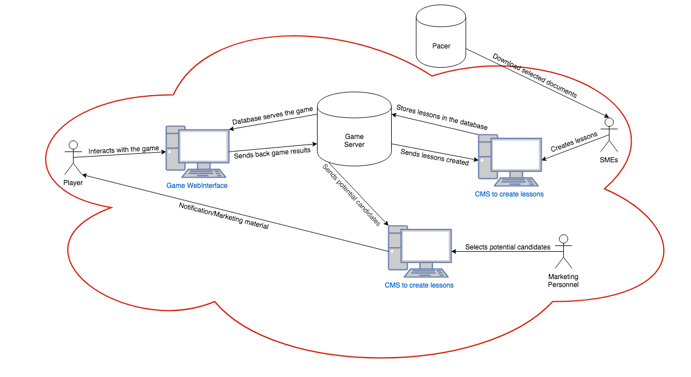
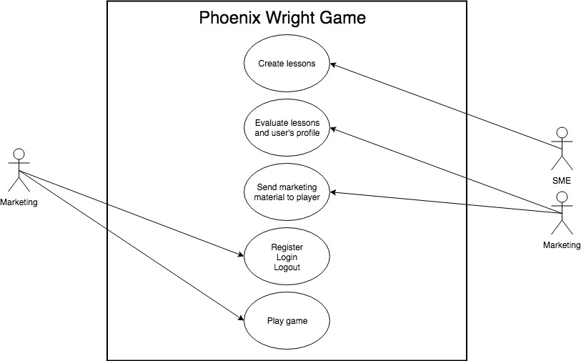
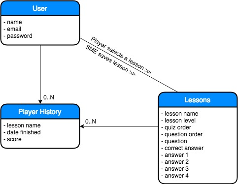
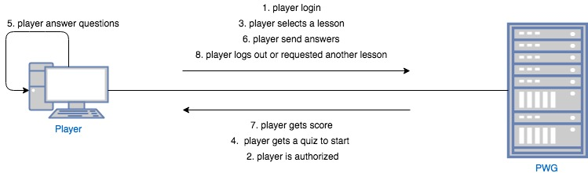
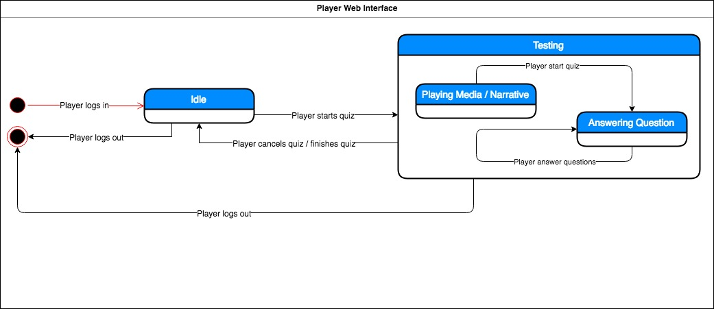

# Lawyer-Up School of Law
# Software Requirements Document

**Authors:** *Kenneth Devon Gaston & Gilberto Diaz*

## Table Of Contents

[TOC]

## Introduction

### Acronyms

- Subject Matter Expert (SME)
- Phoenix Wright Game (PWG)
- Lawyer-Up School of Law (LSL)
- Content Management System (CMS)
- Public Access to Court Electronic Records (PACER)

### Definitions

#### Users Definitions

- **SME** - SME or Subject Matter Experts are attorneys, law experts, professors in law, or any matter expert in the field of law and en employee of the LSL. An SME is responsible for searching court cases in the PACER system and choosing the most suitable for a particular lesson. They are also responsible for redacting all the questions that make up each quiz.
- **Player** - A player is any individual that is not a student of the LSL and is interested in playing the PWG. A player also could be an individual interested in more information about the LSL after playing the PWG. Finally, a player could also be an individual that is targeted by the marketing personnel after playing the PWG. The player is not obligated but expected to interact with the PWG web interface, browse through lessons and play the game.
- **Marketing Personnel** - Marketing personnel is a group of individuals working in the marketing department of the LSL and are employees of the LSL. These people are responsible for evaluating player's results after a player completes a lesson of the PWG. They also send marketing material and electronic communication to players that have engaged with the PWG. An individual part of the Marketing team is responsible for evaluating player's scores and profile and selecting the appropriate marketing material to send to the player.
- **PACER** - PACER is an electronic public access service of United States federal court documents. I allows users to obtain case and docket information from the United States district courts, United States courts of appeals, and United States bankruptcy courts. PACER will be the used as a source of data by the SMEs to create lessons.

#### Entities Definitions

- User - The `User` entity will represent all people that need to be registered in the LSL system for interacting with any PWG software interface. In the current scenario, we have three users (Player, SMEs, Marketing Personnel) that will be interacting with PWG. SMEs and Marketing personnel that are employees of LSL and Player which are not employees of LSL. `User` is not any employee of the LSL but just those employees interacting with PWG and the player.
- Player History - The `Player History` entity will represent the progress each player have in the PWG. The history is composed by the score, lesson name, quiz number, and player information. `Player History` is not a lesson or a quiz, but strictly the player's history in the PWG.
- Lessons - The `Lessons` entity will represent a lesson, quizzes, and questions that constitute the PWG. A lesson will be grouped by topics such as divorce or medical malpractice. A lesson is composed by one quiz or several quizzes. The `Lessons` is not a quiz on its own.

#### Technical Definitions

- TODO:

### Purpose

This document lays out the software requirements of an edutainment website/game that exposes various aspect of law and document processing based on real world cases. The game is meant to be used as a marketing tool to attract potential students to the university.

### Intended Audience

All people that are interested in pursuing a law career.

### Scope

The lucrative Lawyer-Up School of Law wants to create an edutainment website that takes real-world cases from PACER's website to create an interactive game that engages potential law students. People that chose to play will get a sense of real-world law cases through a series of interactive lessons and answering questions. The player might advance in the game by having correct answers and leveling up to more difficult questions. The goal of the game is to introduce an audience attracted to study law and potentially recruiting them into the Lawyer-Up School of Law.

## System Description

The PWG tries to attract people that might be interested in a Law career. The game has lessons that are focused on real-world cases that are retrieved from the Pacer system. Each case will be pull from PACER's website is carefully selected by the SMEs. Lessons have a series of quizzes or challenges ranked by difficulty and each quiz is composed of multiple choice questions. Lessons are ranked by difficulty as well. The player needs a score of 70% or greater to move to the next quiz. The player can move on to the next level once he finishes all quizzes in the current level.

Once a player finishes a quiz, the quiz's score and user's profile information will be available to the Marketing team for them to assess. After performing a marketing analysis on the data, the Marketing team starts sending marketing material to all the players. The Marketing team will also carefully selects players to potentially sending personalized electronic material.

### Use Cases

#### Use Case 1 - SME creating a lesson

Item | Description
------------ | -------------
Event | Create a lesson
Actor | SME
Basic Steps | SME will carefully select and download a court case from PACER's website. After evaluating a court case an SME will create a lesson utilizing the CMS with its respective quizzes and eventually saved to the database.
Preconditions | SME must be an employee of the University and authorize to work with the PWG.
Alternate Steps | N/A
Exceptions | ?
Business Validation/Rules | ?
Post-conditions | ?

#### Use Case 2 - Marketing personnel evaluating a lesson
Item | Description
------------ | -------------
Event | Evaluating a lesson
Actor | SME
Basic Steps | After a player finishes a quiz, the Marketing team is prompted to evaluate that lesson in the CMS. Based on some progress criteria established by the marketing team, the marketing team member will select what kind of marketing material will be used with that particular player.
Preconditions | A player must finish a quiz.
Alternate Steps | N/A
Exceptions | ?
Business Validation/Rules | ?
Post-conditions | ?

#### Use Case 3 - Player creating an account
Item | Description
------------ | -------------
Event | Player creating an account
Actor | Player
Basic Steps | Once a player lands in the registration page, the player will fill the form with a valid email address and a secure password and click the submit button.
Preconditions | N/A
Alternate Steps | Player will receive an email with a link to confirm their email. The player needs to click in the `confirm email address` link.
Exceptions | ?
Business Validation/Rules | ?
Post-conditions | After player clicks the link in the confirmation email, player will be redirect to the login page.

#### Use Case 4 - Player taking a quiz (Fully Dressed)

- Primary Role: Player
- Success scenario of player taking a quiz
   - Player logs in and navigates to the lesson's page.
   - Player clicks in the next available lesson to start playing.
   - Player watches lesson, and is afterwards given a quiz based on what they learned
   - Player answers all the questions and clicks the submit button.
   - Player’s grade is stored in their Player_History.
   - Player can logout or keep playing for the next quiz available.
- Variation Scenarios:
   - Variation 1: The Lesson is Unfinished
       - Player can finish the quiz and clicks the logout button.
       - Player is warned that leaving the page will cause to lose all progress in the lesson.
       - Player logs out and is redirect to the home page.
   - Variation 2: Player fails the quiz
       - Player logs in, navigates to the lesson page and starts a quiz.
       - Player answers all questions in the quiz and clicks the submit button.
       - The grade comes back and is lower than 70%.
       - The player is prompted to review the material and retake the quiz.
- Exceptions
    - Exception 1: Database is offline when Player finishes quiz and clicks submit
        - The Player clicks the submit button after he successfully finishes a quiz.
        - The system attempts to store quiz's score into the database unsuccessfully.
        - An exception message returns to the browser letting the player know that the communication with the database was unsuccessful. It will also let the player know that any progress made will not be lost and will be sync at next login.
        - Next time player logs in, the player will see in the page a progress status of the game syncing with the database. If the database is online, the player will be notified that all pending progress is successfully saved in the database. If the database is offline, it will loop back to the previous step.

### Entity Relationship Diagram

#### Acceptance Criteria Measurements
- The lessons and quizzes must always proceed in their intended order
- The quizzes must be intuitive to interact with for the user
- The quiz answers and results must not be vulnerable to modifications from non-administrative parties
- The answers submitted during quizzes must be evaluated within at most 0.5 seconds of submission.
- The Player’s History must be updated with the results of the evaluated quizzes within 0.7 seconds of said evaluation
- No score in the History can be lower than 0%

#### ER Tradeoffs

- The structure of each quiz is static in both its order and its content lieu of being randomized in both regards to ensure that the material cannot be memorized. We feel that this is acceptable because the lessons themselves are more concerned with getting people interested in both law and the school than serving as a fully educational format
- Failing a quiz forces a player to retake the lesson for the quiz instead of simply allowing them to retry the quiz. Lesson will be short and an option to speed up these sections can alleviate this issue, along with the fact that the order of and the content of the questions is static

### Communication Diagram

### Player's Web Interface State Diagram

